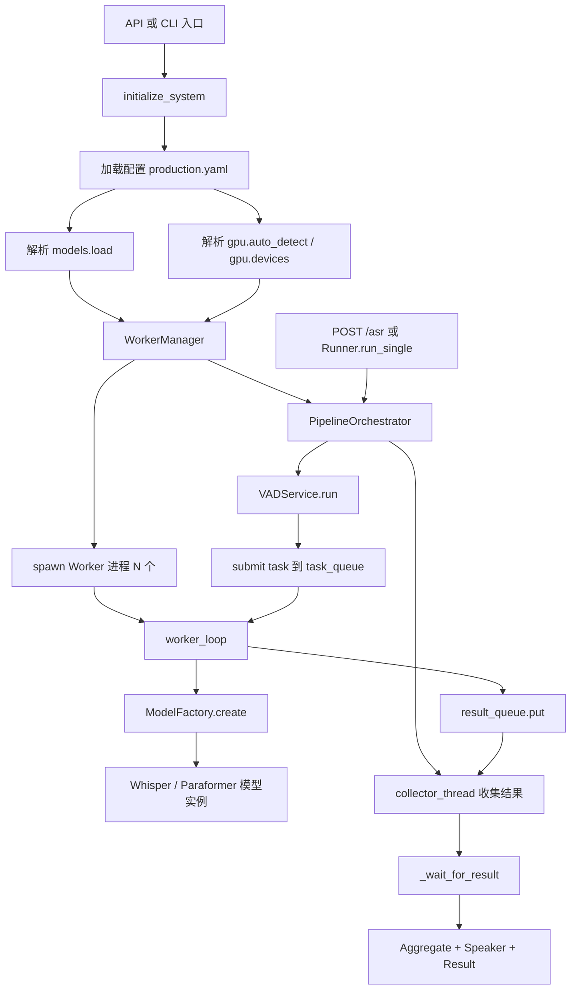
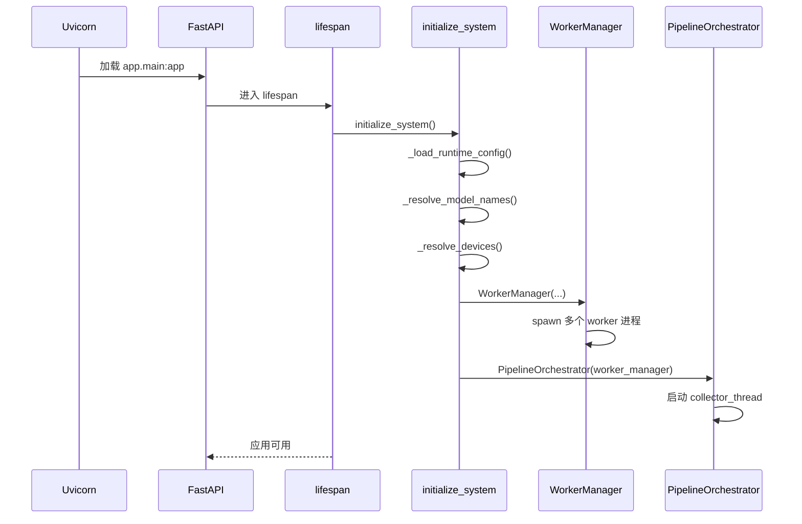
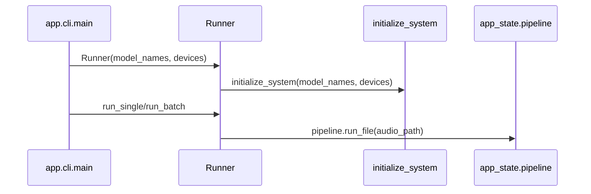
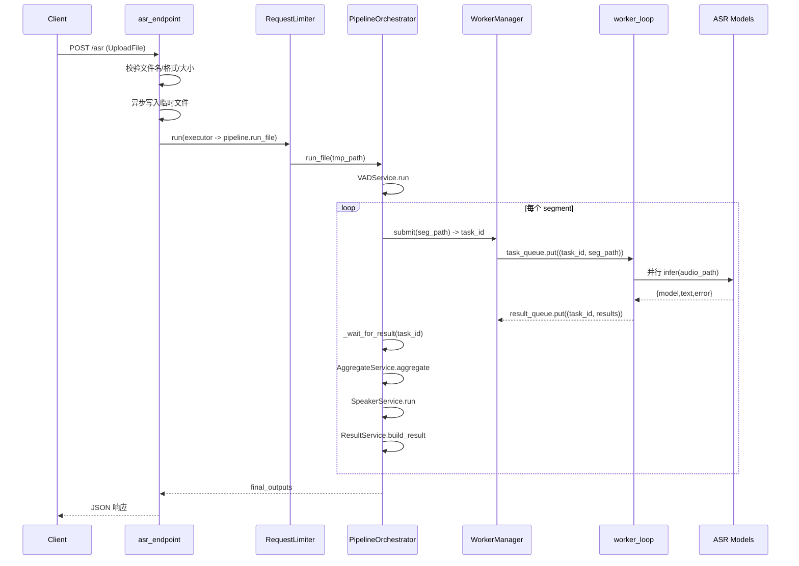

# ASR Enterprise 执行逻辑与调用链路

本文档描述当前项目从启动到请求处理的完整执行线路，覆盖 API 模式与 CLI 模式，并给出关键方法的输入、输出与作用。

## 1. 运行模式总览

项目有两条主执行入口：

1. API 模式：`python -m uvicorn app.main:app --workers 1`
2. CLI 模式：`python -m app.cli --input ...`

两种模式共享同一套核心管线：

- `app.lifecycle.initialize_system`
- `workers.WorkerManager` + `workers.worker_process.worker_loop`
- `services.PipelineOrchestrator`
- `models.ModelFactory` + 各模型插件

## 2. 组件关系图



## 3. 启动阶段调用线路

### 3.1 API 启动链路



### 3.2 CLI 启动链路



说明：

1. CLI 传入的 `--models/--devices` 优先于配置文件。
2. API 模式调用 `initialize_system()` 无参数，完全由配置文件决定。

## 4. 单次 ASR 请求链路



## 5. 关键方法输入输出说明

## 5.1 `app/lifecycle.py`

| 方法 | 输入 | 输出 | 作用 |
|---|---|---|---|
| `detect_devices()` | 无 | `List[str]` | 自动探测可用 GPU，失败回退 `["cpu"]` |
| `_load_runtime_config()` | 环境变量 `ASR_CONFIG_PATH`（可选） | `dict` | 读取运行配置，默认 `configs/production.yaml` |
| `_resolve_model_names(runtime_config, model_names)` | 配置字典、可选模型列表 | `List[str]` | 解析最终模型列表 |
| `_resolve_devices(runtime_config, devices)` | 配置字典、可选设备列表 | `List[str]` | 解析最终设备列表 |
| `initialize_system(model_names=None, devices=None)` | 可选模型与设备 | 无（更新 `app_state`） | 初始化 worker 与 pipeline |
| `lifespan(app)` | FastAPI app | async context manager | 启动初始化与关闭清理 |

### 5.2 `workers/worker_manager.py`

| 方法 | 输入 | 输出 | 作用 |
|---|---|---|---|
| `__init__(model_names, devices)` | 模型名列表、设备列表 | `WorkerManager` 实例 | 用 `spawn` 创建 worker 进程与队列 |
| `_health_check()` | 无 | 无 | 周期性检查子进程存活 |
| `submit(audio_path)` | 音频路径 | `task_id:int` | 写入任务队列 |
| `get_result(timeout=None)` | 超时秒数 | `(task_id, result)` | 从结果队列取结果 |
| `shutdown()` | 无 | 无 | 发送 STOP、join、必要时 terminate |

### 5.3 `workers/worker_process.py`

| 方法 | 输入 | 输出 | 作用 |
|---|---|---|---|
| `worker_loop(device, model_names, task_queue, result_queue)` | 设备名、模型名、任务队列、结果队列 | 长驻循环 | 子进程入口：加载模型，消费任务并回写结果 |

`worker_loop` 内部关键动作：

1. 根据 `device` 设置 `CUDA_VISIBLE_DEVICES`。
2. 创建 `GPUManager(auto_detect=False, devices=[runtime_device])`。
3. `ModelFactory.create(model_names, gpu_manager)` 实例化模型。
4. 从 `task_queue` 获取 `(task_id, audio_path)`。
5. 用线程池并行调用每个模型的 `infer`。
6. 将模型结果写入 `result_queue`。

### 5.4 `services/pipeline_orchestrator.py`

| 方法 | 输入 | 输出 | 作用 |
|---|---|---|---|
| `__init__(worker_manager)` | `WorkerManager` | `PipelineOrchestrator` 实例 | 初始化 VAD/聚合/结果服务与 collector 线程 |
| `_collect_results()` | 无 | 无 | 后台线程：持续消费 `result_queue`，缓存到 `results_dict` |
| `_wait_for_result(task_id, timeout=300)` | 任务 ID、超时 | 模型结果 | 阻塞等待指定任务结果 |
| `run_file(audio_path)` | 音频路径 | `List[dict]` | 主编排：VAD -> submit -> wait -> aggregate -> result |

### 5.5 `services/*`

| 方法 | 输入 | 输出 | 作用 |
|---|---|---|---|
| `VADService.run(audio_path)` | 音频路径 | `List[segment]` | 语音分段（当前默认单段） |
| `AggregateService.aggregate(asr_results)` | 模型结果列表 | `(text, confidence)` | 多模型结果投票聚合 |
| `SpeakerService.run(audio_path)` | 音频路径 | `dict` 或 `None` | 说话人识别（默认关闭） |
| `ResultService.build_result(...)` | 结构化字段 | `dict` | 统一输出 JSON 结构 |

### 5.6 `models/*`

| 方法 | 输入 | 输出 | 作用 |
|---|---|---|---|
| `register_model(name)` | 模型注册名 | 装饰器 | 将模型类注册到 `MODEL_REGISTRY` |
| `get_model_class(name)` | 模型名 | 模型类 | 获取已注册模型类 |
| `ModelFactory.create(model_names, gpu_manager)` | 模型名列表、设备分配器 | `List[model]` | 导入模型插件并实例化（支持失败跳过） |
| `BaseASRModel.__init__(model_name, device)` | 模型名、设备 | 模型实例 | 通用加载流程，调用 `load_model()` |
| `WhisperTurboModel.infer(audio_path)` | 音频路径 | `text` | Whisper 推理 |
| `ParaformerZhModel.infer(audio_path)` | 音频路径 | `text` | Paraformer 推理 |

### 5.7 `app/main.py` API 层

| 方法 | 输入 | 输出 | 作用 |
|---|---|---|---|
| `asr_endpoint(file)` | `UploadFile` | `{"success","request_id","data"}` | 对外 ASR 接口主流程 |
| `health_check()` | 无 | 服务状态 JSON | 返回 worker/pipeline 健康信息 |
| `metrics()` | 无 | 指标 JSON | 返回 GPU、队列长度等信息 |

## 6. 配置生效规则

配置文件：`configs/production.yaml`

关键字段：

```yaml
gpu:
  auto_detect: true|false
  devices: ["cuda:0","cuda:1"]

models:
  load:
    - whisper_turbo
    - paraformer_zh
```

解析优先级：

1. CLI 显式参数（`Runner(model_names, devices)`）优先。
2. 若未显式传参，读取配置文件。
3. 若 `gpu.auto_detect=true`，优先自动探测，忽略 `gpu.devices`。
4. 若配置文件不可用，回退默认模型与自动探测设备。

## 7. 当前输出数据结构

`POST /asr` 成功响应：

```json
{
  "success": true,
  "request_id": "2026-xx-xxTxx:xx:xx_xxx.wav",
  "data": [
    {
      "audio": "/tmp/xxx.wav",
      "text": "识别文本",
      "confidence": 1.0,
      "speaker": null,
      "models": [
        {"model": "whisper_turbo", "text": "...", "error": null},
        {"model": "paraformer_zh", "text": "...", "error": null}
      ]
    }
  ]
}
```

## 8. 非主链路模块说明

以下模块当前不在 API/CLI 主执行线路中，但作为扩展能力保留：

1. `services/asr_service.py`
2. `core/config.py`
3. `infra/retry.py`
4. `infra/metrics.py`

